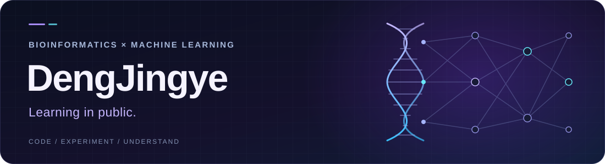

<p align="center">
  
</p>

<p align="center">
  <strong>探索生物信息学、可信科学工具与大模型训练。</strong>
</p>

<p align="center">
  <code>Single-cell</code> · <code>Nanopore</code> · <code>LLM Learning</code> · <code>Reproducible Research</code>
</p>

我的公开项目涉及单细胞分析、纳米孔信号和科学工具评估。希望把问题、实现与验证放在一起：理解方法的适用条件，也认真记录实验的边界。

### 正在学习 · Building understanding

目前正在跟练 [MiniMind](https://github.com/jingyaogong/minimind) 与 [MokioMind](https://github.com/Wood-Q/MokioMind)，从代码出发理解小型语言模型的结构和训练过程。

```text
Tokenizer → Transformer → Pretraining → SFT → Evaluation
 分词与数据     模型结构        预训练      指令微调      评估与复现
```

这是一条正在推进的学习路线。每一步都以读懂实现、跑通小规模实验、解释实际输出为目标。

### 公开项目 · Selected projects

| 项目 | 关注的问题 |
| :--- | :--- |
| [IsoUMI](https://github.com/DengJingye/New_IsoUMI) | 长读长单细胞 BAM 的 UMI 校正与分子级去重。 |
| [SquiggleSpecies](https://github.com/DengJingye/SquiggleSpecies) | 纳米孔原始电信号的微生物分类、数据划分审计与评估。 |
| [SCKG-Agent](https://github.com/DengJingye/SCKG-Agent) | 面向单细胞、空间与多组学工具选择的证据约束 Agent 原型。 |
| [scBatch-Select](https://github.com/DengJingye/scbatch-select) | 单细胞批次整合方法评测与多目标决策。 |

### 我在意的实践 · Working principles

- **理解实现**：从输入、张量形状和数据流读懂方法。
- **可复现实验**：记录数据划分、seed、配置和关键参数。
- **证据与边界**：用实际结果支撑结论，区分原型、已验证能力与下一步计划。

<p align="center">
  <sub>Read the code. Run the experiment. Explain the result.</sub>
</p>
